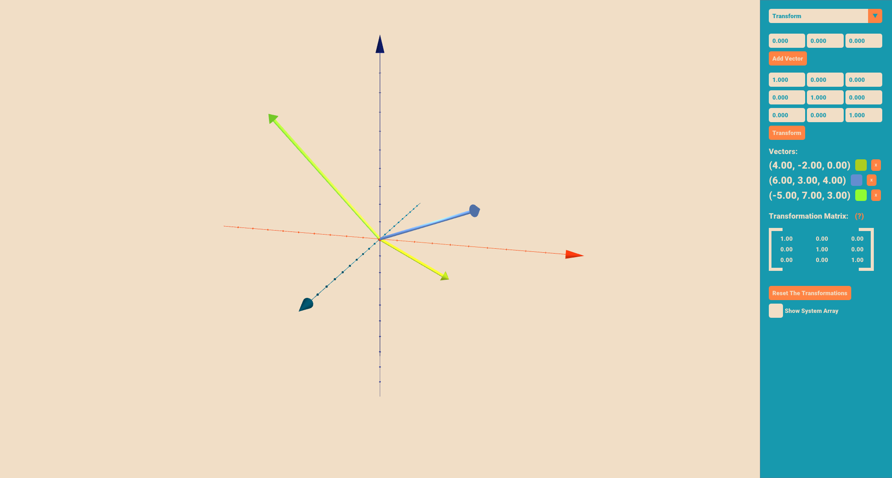
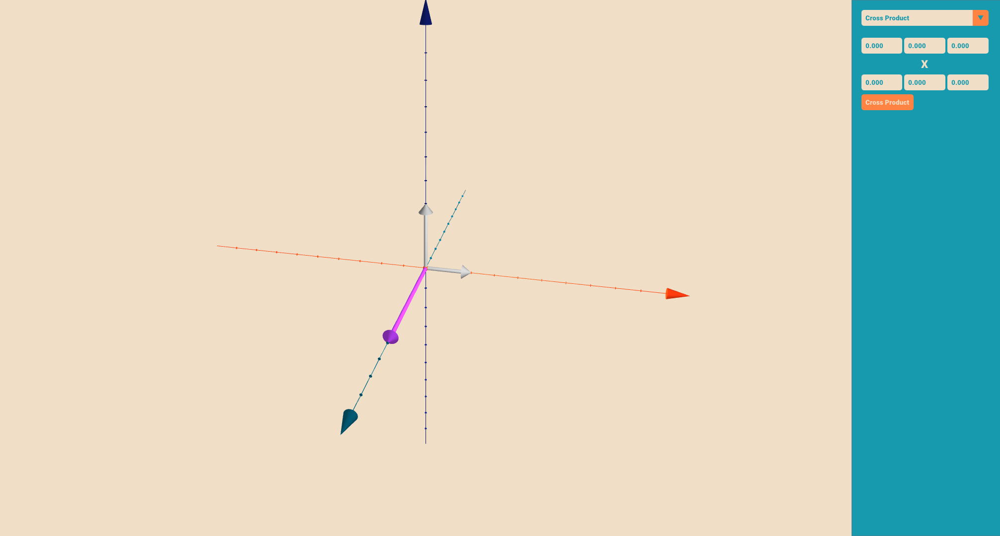
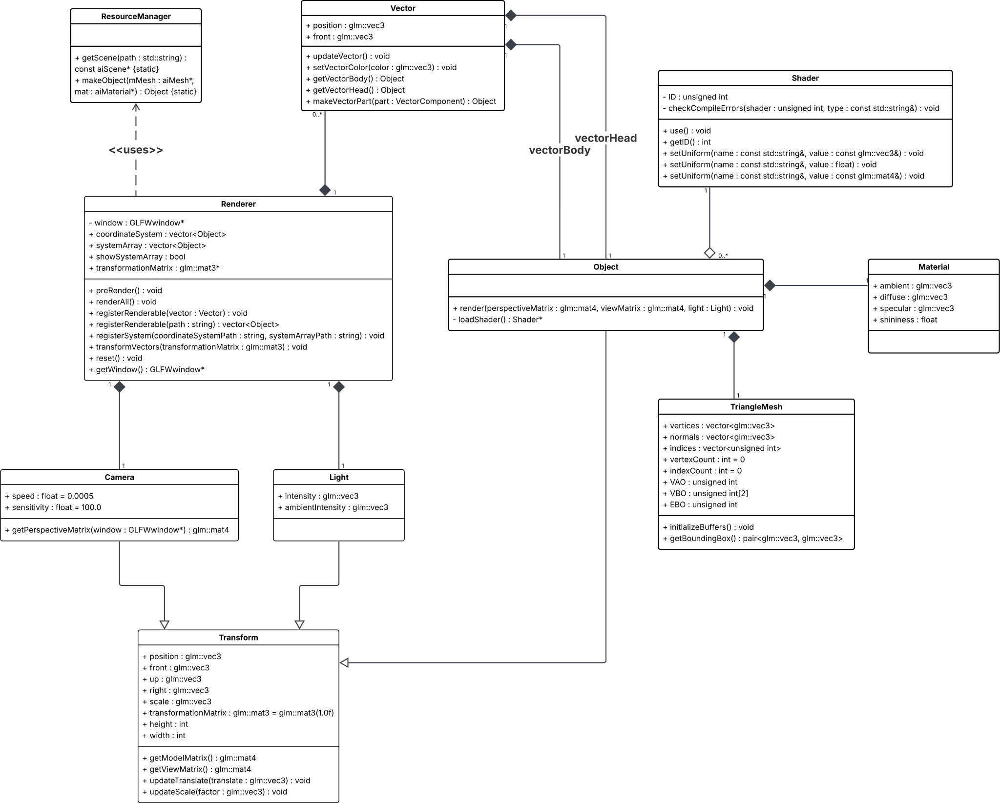

# Linear Algebra Playground

> Interactive 3D visualization of linear transformations and the vector (cross) product using **C++** and **OpenGL**.



## Overview

**Linear Algebra Playground** is an interactive desktop application designed to help students and developers build intuition for key concepts in linear algebra through real-time 3D visualization.

The application focuses on:

- **Linear transformations** represented by 3×3 matrices
- **Vector visualization** in a 3D Cartesian coordinate system
- **Geometric interpretation of the vector (cross) product**

By combining modern OpenGL rendering with an intuitive GUI, the project bridges the gap between abstract mathematical theory and visual understanding.

## Features

### 🔹 Linear Transformation Mode

- Add an arbitrary number of 3D vectors
- Enter custom **3×3 transformation matrices**
- Apply transformations **sequentially** (matrix composition)
- Transform:

  - All vectors
  - The coordinate system
  - The coordinate grid

- **Smooth animated transitions** between transformations
- Toggle coordinate grid visibility
- Change vector colors interactively


### 🔹 Vector (Cross) Product Mode

- Input exactly **two vectors**
- Automatically computes and visualizes their **cross product**
- Clear color distinction:

  - Input vectors: gray
  - Resulting vector: purple

- Demonstrates:

  - Orthogonality
  - Direction (right-hand rule)
  - Dependence on vector order (anti-commutativity)

- Simplified view (grid disabled for clarity)



> Switching between modes resets the scene to keep each mode independent and focused.

## Technologies Used

- **C++** – Core application logic
- **OpenGL (Modern Pipeline)** – 3D rendering
- **GLFW** – Window creation and input handling
- **GLAD** – OpenGL function loading
- **Dear ImGui** – Immediate-mode graphical user interface
- **GLM** – Linear algebra mathematics (vectors, matrices)
- **Assimp** – Loading 3D models

## Architecture Overview

The system is built using a modular, object-oriented design:

- **Renderer** – Handles OpenGL initialization and scene rendering
- **Vector / Object classes** – Represent vectors and 3D entities
- **GUI** – Manages all user interaction (ImGui-based)
- **InputManager** – Mouse and camera control
- **ResourceManager** – Loads and converts 3D assets

Linear transformations are applied using matrix multiplication and passed to shaders as uniform variables, while animations are handled incrementally for smooth visual transitions.



## Educational Purpose

This project is primarily intended for:

- Students learning **linear algebra**
- Computer graphics and engineering education
- Visual exploration of abstract mathematical concepts

Compared to tools like GeoGebra, this application offers:

- Full control over transformation matrices
- Animated transformations of the entire coordinate system
- Dedicated visualization of the vector cross product

## Build & Run (High-Level)

> ⚠️ Exact build steps depend on your environment and toolchain.

General requirements:

- C++17-compatible compiler
- OpenGL-capable GPU
- Installed dependencies:

  - GLFW
  - GLAD
  - GLM
  - Dear ImGui
  - Assimp

Clone the repository:

```bash
git clone https://github.com/matino06/linear-algebra-playground.git
```

Then configure and build using your preferred build system (e.g. CMake).
